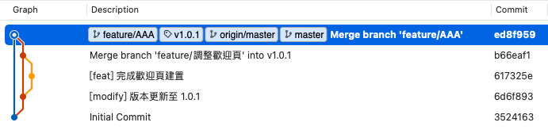
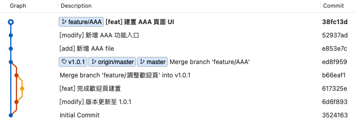
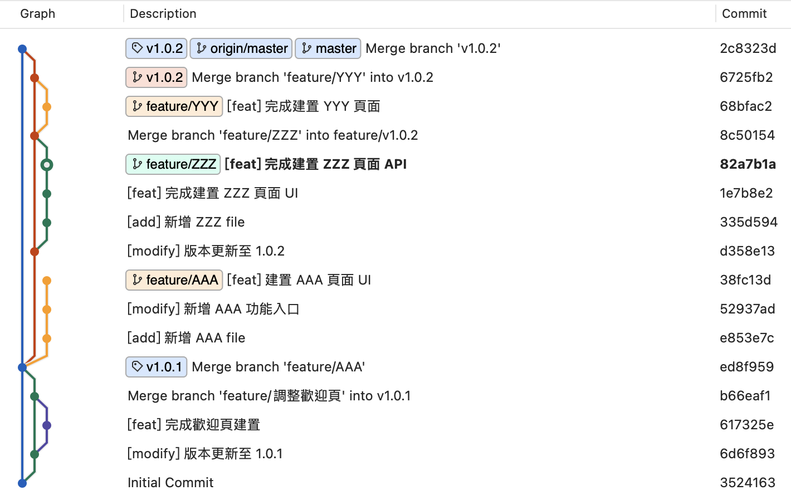
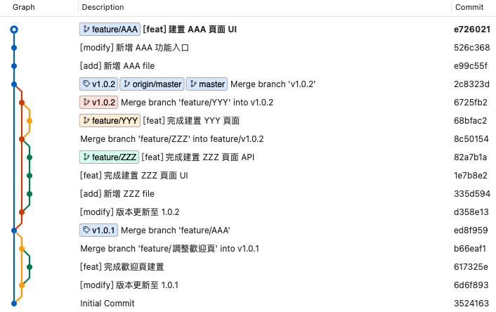
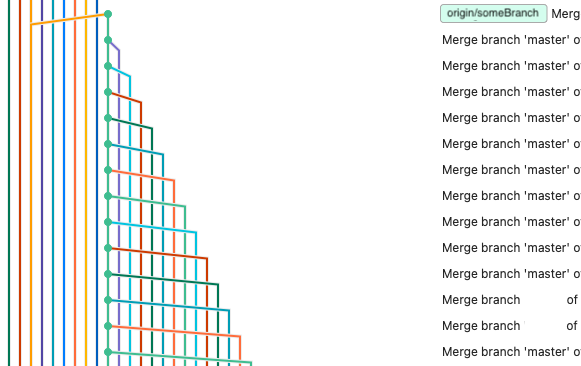

# Git Instruction


## 目錄

* [分支](#1)
    * [分支種類](#分支種類)
    * [Code Review 流程](#code-review-流程)
        * [流程說明](#流程說明)
    * [rebase 好處](#rebase-好處)
* [Commit Message](#commit-message)
    * [元素](#元素)
    * [格式](#格式)
* [Tag](#tag)


<br>
<br>

## 分支

### 分支種類
#### main

上面每一個 commit 都是從[版本分支](#版本分支) merge 進來，開發者不能直接在這條分支上進行 commit，每一個 commit 都是一個上架版本，請待確實上線後再將[版本分支](#版本分支)合併至 master 並用 [Tag](#tag) 加註版本號。

#### 版本分支

版本分支，開頭 v 請使用小寫後接版號，每當需要進行上版時從當前 master 最後的 commit 建立該分支並將需要在這一版本上線的 `feature/` 或 `hotfix/`分支  rebase 到這條分支，並開始進行 [code review](#code-review-流程)。

#### feature/

當你準備開始開發某項功能，請至當前 master 分支創建該分支進行開發。feature/ 後接該功能英文或中文描述，**需為每一個切分的功能建立分支**，並且確實只將此項功能相關異動 commit 在該分支上，待功能開發完要上線時則 rebase 到 [版本分支](#版本分支) 並至 gitlab 發 merge request 進行 [code review](#code-review-流程)。

#### hotfix/
與 feature/ 大致相同，當此調整為修正問題相關時請使用這個名稱。

        
 
<br>
<br>

### Code Review 流程

#### 流程說明

假設最剛開始長這樣，你準備開始開發 `AAA` 功能於是你到 master 建立一條 `feature/AAA` 
 


然後你開始針對你的功能提交三個 commit `38fc13d`、`52937ad`、`e853e7c`



master 在你開發的時候，版本 v1.0.2 要進行上版 (這版要上 ZZZ 及 YYY 功能)

1. 開出 `v1.0.2` 分支
2. ~~第一個 commit `d358e13` 更新這次上版的版號~~ **因版本異動頻繁版號更改 commit 請延至確定上線後再於版本分支進行**
3. 看誰要先 code review 這裡是 `feature/ZZZ` 先，於是 `feature/ZZZ` rebase 到 `d358e13` 發 merge request 進行 code review，完成後會 merge 進 `v1.0.2` 產生出 `8c50154`
4. 下一個要 code review `feature/YYY` rebase 到 `8c50154` 後進行 code review
5. 待版本確實上線後 `v1.0.2` 就可以 merge 進 `master`

 

這時候你的 `feature/AAA` 可以 rebase 到最新 master `2c8323d `，你也可以等到你要上版的時候在 rebase 到你上版的版本分支，不過累積好幾個版本你一次過處理會很麻煩建議一版一版處理

 

<br>


### rebase 好處

如果你在開發的功能，在很早之前就啟動然後不斷的因為 master 更新，將 master merge 到你開發分支上，讓你分支產生很多與該分支功能不相關 merge commit 線條紊亂不易閱讀，且每顆 merge commit 通常異動 file 都很多，很容易夾帶偷渡的程式碼，對於閱讀理解你程式碼的同事是不友善，他不可能去檢視你每一顆 merge 中是否夾帶偷渡程式碼，請盡量使用 rebase 進行合併操作。

<p>




 
<br>
<br>


## Commit Message

### 元素

#### What 做了什麼事 (required)

這個版本修正了什麼 bug 、新增了什麼 feature、或是優化了什麼效能，也可能只是簡單的文字修正。這是一個最重要的一部分，必須要清楚直白地告訴開發者這個提交版本的目的，一個 commit 只做一種[標籤](#標籤-required)屬性的事情。

#### Why 為什麼做 (optional)

一個常見的錯誤是我們只記錄了提交版本做了什麼事情，但卻沒有說明為什麼要做這件事情，當時間一久回來追朔問題的時候，常常已經不記得當初更動的動機與原因是什麼了，所以盡可能地提供提交版本的 Why 資訊可以有效幫助我們理解其背後原因。

#### How 用什麼方法做到 (optional)

至於用什麼方法做到提交版本的目的，在大部分簡單單純的提交版本中是不需要特別詳註的，建議是有需要特別補充的才紀錄在訊息中，並且應該是提供高層級（High-level）的方法與概念的敘述（例如用了什麼演算法，設計模式等），而不是方法的實際細節。方法細節應當透過更動的程式碼本身以及程式碼註解來自行解釋。

<br>
<br>


### 格式

```
[標籤] 標題 
                    <<<< 請注意標題和本文需要有一行空白換行
本文
```

#### 標籤 (required)

| 標籤 | 說明 | 
| :-- | :-- | 
| **fix** | bug 修正 |
| **new** | 新增功能 |
| **modify** | 功能上異動非 bug |
| **style** | 格式優化：刪除增加空格或換行，刪除註解程式碼，移除無用方法，重新命名更貼切名稱...<br>總之就是讓 code 變美麗 |
| **refactor** | 重構 |
| **update** | 套件升版更新，或任何一切升版更新 |
| **add** | 新增檔案 |
| **remove** | 刪除檔案 |
| **test** | 測試程式 |
| **revert** | Git 取消變更 |


#### 標題 (required)

* **最多50個字**
    
    關於 50 字元建議只是一個經驗值，這部分可根據需求做調整，最主要目的是配合 Git 相關服務的介面限制如 Github（可到 72 個字元）， 如果超過字數限    制的話就無法完整的顯示在介面當中，如果想要閱讀完整訊息，則必須要點擊到詳細的頁面，會增加閱讀的複雜度和效率。
    
    如果你發現你很難在 50 個字元裡摘要你所提交所做的更動，很有可能是你提交版本包含了太多不同屬性的變動，這時候你需要做的是重新整理你的提交內容，將他以較小單位提交。


#### 本文 (optional)

* **本文在 72 字元內需要自行斷行**

    這部分也是考量到閱讀性，若沒有自行斷行的話，在 terminal 或是 Github 介面中印出後會導致訊息過長難以閱讀，所以建議維持在 72 個字元內。


#### 範例

#### ⛔️ Not Preferred
使用 fix 標籤可以不用在贅述 ~~修正~~問題，且單看訊息也無法得知修改內容

```
[fix] 修正問題 
```

### ✅ Preferred:


```
[fix] 確認頁按鈕遮擋被無法點擊
```

```
[fix] 確認頁按鈕遮擋被無法點擊

確定頁frame大小設置錯誤導致
```
```
[fix] 文字輸入框無法辨識

將文字輸入框的背景色加深 20% 提高對比
```

```
[style] 刪除註解程式碼 
```

<br>
<br>

## Tag

當程式確實上線後請在該 commit 加上版本 tag，如果是在本地端操作請記得要推到遠端，格式如下

```
v2.3.4    // v (請使用小寫) ＋ 版本號
```
