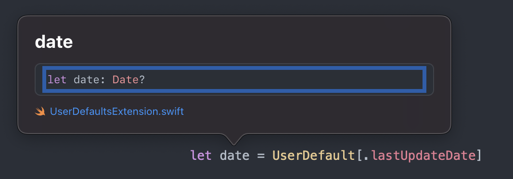

# UserDefault

It allows you to access UserDefaults content in a more concise and intuitive way, while also helping you manage UserDefaults keys better.

## Usage

### Definition
When you need to add a new entry to UserDefaults, you can extend UserDefaults.Key to add a new key for it.

```swift
extension UserDefaults.Key {    
    static var lastUpdateDate: Key<Date> {Key<Date>("lastUpdateDate")}
}
```
Define the type and name of the data to be stored (the stored type must be Codable).<br>
In the example above, a key "lastUpdateDate" is defined with a type of Date.
<br>

### Setting Value
```swift
UserDefault[.lastUpdateDate] = Date()
```
You don't need any additional code, it's quite clean and intuitive, just like using a Dictionary.<br>
Moreover, if the type you assign doesn't match the type defined, it will throw an error prompting you to correct it.

```swift
// Cannot assign value of type 'String' to subscript of type 'Date'
UserDefault[.lastUpdateDate] = "20221111"
```
<br>

### Getting Value
```swift
let date = UserDefault[.lastUpdateDate]
```
When getting a value, it's similarly concise, and the type of date will also be the type you defined, without the need for additional conversion code.





<br><br><br>

# UserDefault (繁體中文)

他可以讓你用更值簡潔直覺方式去存取 UserDefaults 內容，還幫你更好的管理 UserDefaults key 值


## Usage

### 定義

當你需要增加一筆 UserDefaults 資料，你可以 extension UserDefaults.Key 為其新增新的 key

```swift
extension UserDefaults.Key {    
    static var lastUpdateDate: Key<Date> {Key<Date>("lastUpdateDate")}
}
```
定義要儲存資料的 type 及名稱 (儲存的 type 必須是 Codable)<br>
以上面例子為例他定義了一個 "lastUpdateDate" 的 key 其 type 為 Date

<br>

### 設值

```swift
UserDefault[.lastUpdateDate] = Date()
```
完全不需要其他額外的程式，相當乾淨直覺，就像在使用一個 Dictionary<br>
爾且如果你賦予的 type 和他定義的 type 不相同，他還會跳出錯誤提醒您修正

```swift
// Cannot assign value of type 'String' to subscript of type 'Date'
UserDefault[.lastUpdateDate] = "20221111"
```
<br>

### 取值

```swift
let date = UserDefault[.lastUpdateDate]
```
取值的時候也一樣的簡短，date 的 type 也會是你定義的類型，不需要額外轉換的程式


<br>
